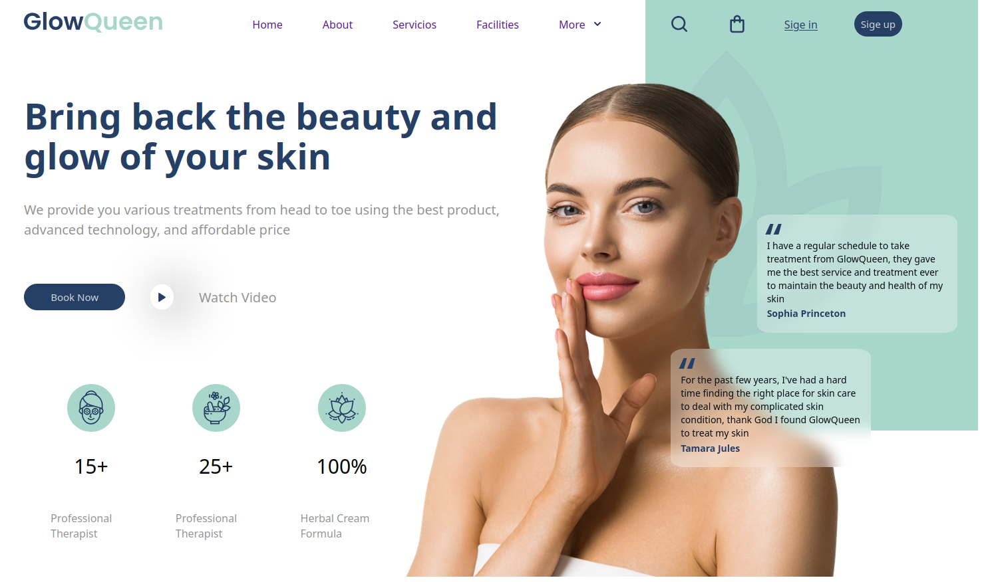

# Spa & Beauty

## 📌 Descripción
Landing page desarrollada como práctica de academia (Conquer Blocks), enfocada en maquetación moderna y organización escalable de estilos.

Se trabajó con Flexbox para la estructura, pseudoelementos (::after) para detalles visuales y metodología BEM para mantener un código claro y mantenible.

El proyecto utiliza SASS para modularizar estilos y Vite como herramienta de desarrollo.

---

## 🎯 Objetivo
Practicar maquetación profesional, estructura de estilos y flujo de trabajo con herramientas modernas del frontend.

---

## 🚀 Tecnologías
- HTML
- CSS
- SASS
- Vite
- BEM

---

## 📸 Preview


---

---
## 🌐 Deploy
👉 [Ver sitio en vivo](https://spa-beauty-lovat.vercel.app/)##
---
---

## 📂 Estructura

El proyecto está organizado de forma modular:

- **/src**
  - `main.js`: punto de entrada de Vite
  - `/sass`: estilos organizados por responsabilidad
    - `/abstracts`: variables y mixins
    - `/base`: estilos globales (reset, tipografía)
    - `/components`: componentes reutilizables
    - `/layout`: estructura principal (header, hero, navbar)
    - `/pages`: estilos específicos de la página

- **/public**
  - `/IMG`: imágenes y recursos estáticos

---

## ⚙️ Instalación

```bash
npm install
npm run dev
